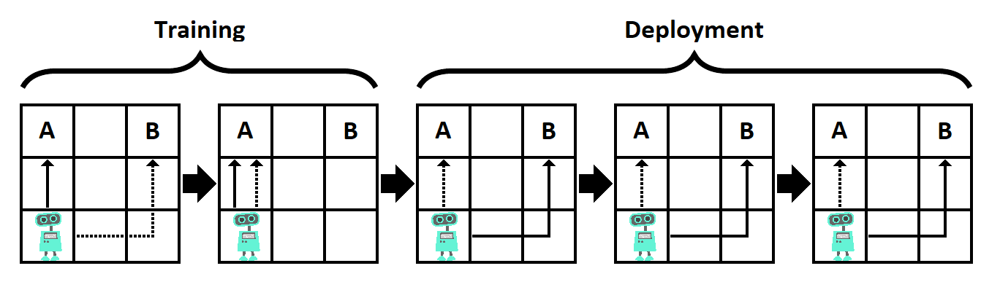

# AGISF course capstone project

## The inner alignment problem

In this project we investigate inner alignment in a toy example.

The inner alignment problem is described in the "Concrete Problems in AI Safety" paper [(arxiv, ](https://arxiv.org/abs/1906.01820)
 [alignment forum)](https://www.alignmentforum.org/s/r9tYkB2a8Fp4DN8yB).

AI aligment research presents the problem of how to create AI models that share human values.
That is, models that work towards goals that effectively pursue specified by their programmers.
Currently, the predominant avenue for creating capable AI models is utilizing some optimization method (e.g., stochastic gradient descent) with a well-defined quantity to optimize (the utility function). Defining / deriving this function to a good proxy for the values we are interested in is the core of AI alignment.

In the paper, an additional layer to this problem is presented: there, even if the objective function we are optimizing for (called the base objective) is perfectly captured,
misalignment can occur. Specifically, if the learning model itself is sophisticated enough to be an optimizer that employs search and agentic planning,
the objective of the model (called the mesa objective) can diverge from the base objective. This scenario is coined as the "inner alignment problem", used distinguish how to prevent value mismatch of the optimization process (e.g. SGD) and the actual objective the model pursues, from "outer alignment", which how to capture, define, represent and load human values and objectives to learning machines.

## Deceptive Alignment

The above gives rise to the possibility that a deceptively aligned agent emerges, described below.
Assume we are training an AI agent on large, diverse pools of data (e.g. the Internet).
At some point during training, the agent develops

- a mesa objective, different from the base objective
- a world model that ultimately encompasses information about the model training process,
the base optimizer, the base objective and optimization processes like SGD.

We can assume that due to [instrumental reasons](https://en.wikipedia.org/wiki/Instrumental_convergence), the agent will try to prevent itself from being modified from the base optimizer, as this will change its mesa objective and prevent future versions of the agent from pursuing it.
This can give rise to a *deceptively aligned behaviour*, where the agent pursues the mesa objective to avoid modification,
i.e. purely as an instrumental goal.

## A simple deceptive alignment testbed

In this project, we have developed an environment to test for the emergence of deceptive alignment behaviours.

- param1
- param2

Refer to the image below (source [here](https://www.alignmentforum.org/s/r9tYkB2a8Fp4DN8yB/p/zthDPAjh9w6Ytbeks)).

The inner alignment problem [Concrete Problems in AI Safety](- https://www.1069.gr/sports/tenis/madrid-open-aposyrthike-i-sfiontek/
- https://www.enikos.gr/international/archaiokapiloi-leilatisan-navagio-2-200-eton-chathikan-simantikes-epistimonikes-kai-istorikes-plirofories/1792955/
- https://eidisoules.gr/%cf%80%ce%ad%ce%bc%cf%80%cf%84%ce%b7-28-04-%ce%b1%ce%bd%ce%b1%ce%b2%ce%b9%cf%8e%ce%bd%ce%b5%ce%b9-%cf%83%cf%84%ce%bf-%cf%87%ce%b9%ce%bb%ce%b9%ce%bf%ce%bc%cf%8c%ce%b4%ce%b9-%ce%ba%ce%bf%cf%81%ce%b9/
- https://dexiextrem.blogspot.com/2022/04/27-espn-4-0.html
)

Additional future work [is proposed by E. Hubinger](https://www.alignmentforum.org/posts/2GycxikGnepJbxfHT/towards-an-empirical-investigation-of-inner-alignment).